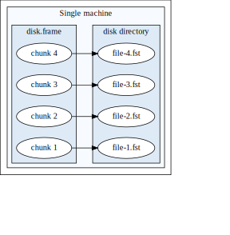

# Test section {#sec:first-section}

hello

# next section

see [@sec:first-section] for more

Also see this picture ([@fig:diskframe-picture]):

{#fig:diskframe-picture}

Some inline R code: `x <- hello("123")`{.R}

# even further sections...

Here is a cool equation:
$$
\forall x \in X, \quad \exists y \leq \epsilon
$$ {#eq:small}

As we can see in [@eq:small], $\exists y \leq \epsilon$

# Another section, with code

```{#lst:some-code .R caption="Here is my caption, here is my spout"}
function(executor) {
    callCC(function(k) {
        resolve <- function(value) {
            print("resolving")
            k(value)
            print("I shouldn't be here")
            }
        reject <- function(value) {
            print("rejecting")
            k(value)
            print("I shouldn't be here")
            }
        executor(resolve, reject)
    })
}
```

Weow, what an amazing function in [@lst:some-code]!!!

And we can also make a table with

a   b   c
--- --- ---
1   2   3
4   5   6

: here is a long caption, I sure hope that I don't get wrapped! {#tbl:label}

Note that in the source, tables are different (very annoying and inconsistent!) see [@tbl:label].
Note the space between caption and label
I want to cite in text @crank1991param and in footnotes [@ariola1995callbyneed]

# References
